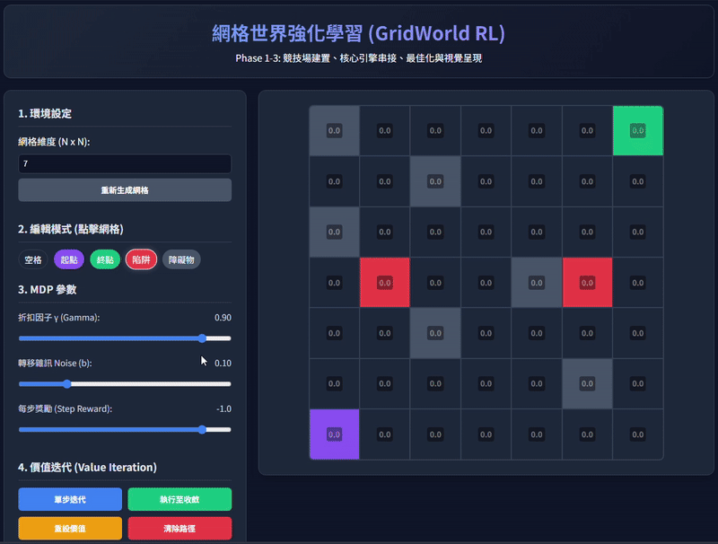

# GridWorld RL (Value Iteration)



## Overview
This project implements a GridWorld environment to demonstrate the core concepts of Reinforcement Learning (RL), specifically focusing on **Value Iteration**. Users can interactively design their own GridWorld by placing a start point, goals, traps, and obstacles. The application visualizes how the State Value Function ($V$) and the corresponding Policy ($\pi$) evolve iteratively based on the Markov Decision Process (MDP) parameters such as Discount Factor ($\gamma$), Transition Noise, and Step Reward. 

## Project Structure
```
GridWorld/
│
├── app.py                 # Flask web server and backend logic for RL calculations
├── demo_file/             # Directory containing demonstrations and reference materials
│   └── Demo.mp4           # Demonstration video of the application
│   └── HW_request.png     # Original homework/project request image
│   └── new2Grid_World_RL_Blueprint.pdf # Reference documentation
│   └── QA_record.md       # Q&A record explaining core mechanics (Noise, Step Reward)
├── static/                # Static assets for the frontend
│   ├── script.js          # Interactive frontend logic and AJAX calls
│   └── style.css          # Styling for the application
└── templates/             # HTML templates
    └── index.html         # Main user interface layout
```

## Key Features
1. **Interactive Grid Editor**: Click and drag to place the Start state, Goals (+10), Traps (-10), and Obstacles on a configurable $N \times N$ grid.
2. **Adjustable MDP Parameters**: 
    - **Discount Factor ($\gamma$)**: Determines the importance of future rewards.
    - **Transition Noise ($b$)**: Simulates a slippery environment where the agent has a probability $b$ of moving perpendicular to its intended direction.
    - **Step Reward**: A constant reward (usually negative, e.g., -1.0) given for every step taken to encourage finding the shortest path.
3. **Real-time Value Iteration Visualization**: 
    - Execute value iteration step-by-step or run it until convergence. 
    - Observe how values propagate through the grid and how the optimal policy updates dynamically.
4. **Policy Extraction & Pathfinding**: Once the optimal policy is computed, the application can extract and draw the optimal path from the Start state to the Goal.

## Demo

[https://github.com/GuanYuXx/GridWorld/raw/main/demo_file/Demo.mp4](https://guanyuxx.github.io/GridWorld/)

## Repository
[https://github.com/GuanYuXx/GridWorld](https://github.com/GuanYuXx/GridWorld)
